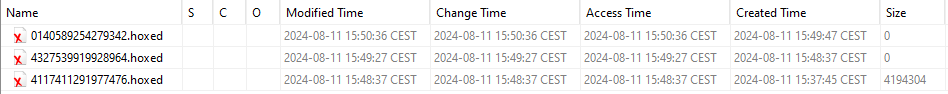
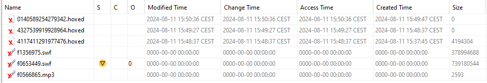
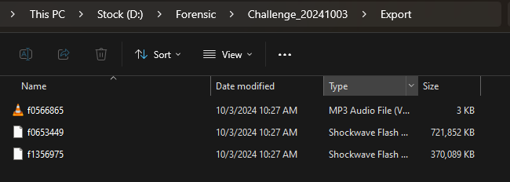

- Find at least two of the three wiped files' real names

- Identify their extensions.

.hoxed and .swf

- Recover any part of the deleted content. (e.g., 5 different video frames, some text from the document, part of the image)

- Let me know how you managed to get them.
I used Autopsy 4.2.1.0 tool on Windows